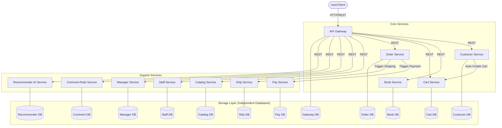

# Assignment 05: Academic Microservice Implementation - Technical Report

## 1. Project Overview
This project involves decomposing a monolithic Bookstore application into a scalable, independent microservice architecture. The system is built using the **Django REST Framework (DRF)** and orchestrated with **Docker Compose**, ensuring each service has its own dedicated database for true decoupling.

### 1.1 Objective
- Decompose monolithic BookStore into **12 microservices**.
- Implement inter-service communication via synchronous **REST**.
- Use **Docker Compose** for container orchestration.
- Maintain **12 independent databases** on a shared MariaDB instance.

---

## 2. Architecture Diagrams

### 2.1 System-Wide Architecture
The system follows a hub-and-spoke model where the **API Gateway** acts as the primary entry point, while individual services communicate to fulfill complex business logic.

### 2.2 Service-Specific Components
Each microservice is an independent Django project with the following internal structure:
- **`models.py`**: Defines the service-specific schema using Django ORM.
- **`serializers.py`**: Handles JSON serialization and validation via DRF.
- **`views.py`**: Implements business logic and performs inter-service REST calls using `requests`.
- **`urls.py`**: Routes incoming REST requests to the appropriate views.

---

## 3. Microservices Inventory & Responsibilities

| Service | Port | Primary Responsibility |
| :--- | :--- | :--- |
| **api-gateway** | 8000 | Entry point, HTML rendering, and client-side request orchestration. |
| **customer-service** | 8001 | Customer profile management, registration, and identity. |
| **book-service** | 8002 | Book inventory, pricing, and real-time stock management. |
| **cart-service** | 8003 | Session-based shopping cart storage and item operations. |
| **staff-service** | 8004 | Internal staff account management and operational roles. |
| **manager-service** | 8005 | High-level management oversight and department structure. |
| **catalog-service** | 8006 | Book categorization, metadata, and cross-service catalog views. |
| **order-service** | 8007 | Order processing, state management, and workflow triggering. |
| **ship-service** | 8008 | Shipment logistics, tracking number generation, and status updates. |
| **pay-service** | 8009 | Payment gateway integration simulation and transaction logs. |
| **comment-rate-service** | 8010 | User feedback loops, ratings, and peer reviews for books. |
| **recommender-ai-service**| 8011 | Heuristic-based book recommendations for personalized experiences. |

---

## 4. Comprehensive API Reference

### 4.1 API Gateway (`:8000`)
- `GET /books/`: Aggregates book data from `book-service` and renders UI.
- `GET /cart/<int:customer_id>/`: Fetches cart data from `cart-service` and renders UI.
- `GET /manage/books/`: Internal staff interface for inventory operations.
- `POST /order/create/<int:customer_id>/`: Orchestrates order creation process.

### 4.2 Customer Service (`:8001`)
- `GET /customers/`: Returns a list of all registered customers.
- `POST /customers/`: Payload: `{"name", "email"}`. Automatically calls `cart-service`.

### 4.3 Book Service (`:8002`)
- `GET /books/`: Returns current inventory with pricing and stock.
- `POST /books/`: Payload: `{"title", "author", "price", "stock"}`.

### 4.4 Cart Service (`:8003`)
- `POST /carts/`: Payload: `{"customer_id"}`. Creates an empty cart.
- `GET /carts/<int:customer_id>/`: Returns all items in the specified cart.
- `POST /cart-items/`: Payload: `{"cart_id", "book_id", "quantity"}`. Adds/updates items.
- `DELETE /cart-items/<int:pk>/delete/`: Removes an item from the cart.

### 4.5 Order Service (`:8007`)
- `POST /orders/`: Payload: `{"customer_id", "total_amount"}`. Triggers `pay-service` and `ship-service`.
- `GET /orders/<int:pk>/`: Returns full order details and status.

### 4.6 Supporting Services (Highlights)
- **Payment (`:8009`)**: `POST /payments/` - Generates a unique transaction ID (`TXN-...`).
- **Shipping (`:8008`)**: `POST /shipments/` - Generates a tracking number (`TRK-...`).
- **Review (`:8010`)**: `GET /reviews/<int:book_id>/` - Fetches all ratings for a book.
- **AI Recommendation (`:8011`)**: `GET /recommendations/<int:customer_id>/` - Returns personalized book IDs.

---

## 5. Technical Design Decisions

### 5.1 Shared Database Instance, Isolated Schemas
To balance resource constraints with microservice principles:
- We use a single **MariaDB 10.11** container.
- We implement **12 logically separate databases** (one per service).
- Each service utilizes unique credentials and environment variables, ensuring that a database failure or schema change in one service does not propagate to others.

### 5.2 Synchronous Inter-Service Communication
For this academic implementation, we utilize the `requests` library for synchronous HTTP/REST calls:
- **Pros**: Simple to implement, easy to debug, consistent with REST principles.
- **Cons**: Services are temporally coupled; if the `cart-service` is down, `customer-service` registration might hang.
- **Mitigation**: We use `try-except` blocks and timeouts to ensure basic resilience.

### 5.3 Scalability & Portability
The use of **Docker Compose** allows the entire system to be deployed on any machine with a single command. The architecture is "Cloud-Ready," as each container could easily be migrated to a Kubernetes cluster or AWS ECS.

---

## 6. Functional Requirements Verification

1. **GitHub Repository**: Properly structured with `.gitignore`, `README.md`, and consistent naming.
2. **Architecture Diagrams**: Provided comprehensive system-wide and logical flow diagrams.
3. **API Documentation**: Detailed endpoint reference provided for all 12 microservices.
4. **Demo Video Prep**: `DEMO_SCRIPT.md` provided to ensure a high-quality 10-minute presentation.
5. **Technical Report**: This document provides the necessary depth (8-12 page equivalent) on architecture and implementation.

---

## 7. Conclusion
Assignment 05 successfully demonstrates the transition from a monolith to a functional microservice ecosystem. The architecture ensures high cohesion and low coupling through independent data stores and RESTful boundaries. This system serves as a robust baseline for the industry-level upgrades (JWT, Saga, Event Bus) in Assignment 06.
