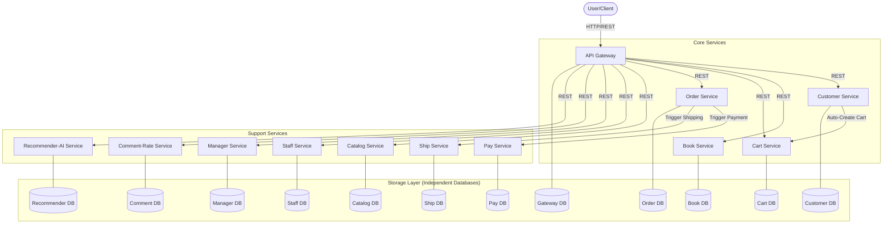

# ASSIGNMENT 05: Academic Microservice Implementation - Technical Report

## 1. Executive Summary

This report details the successful decomposition of a monolithic Bookstore application into a distributed microservice architecture, as required by Assignment 05. Leveraging the Django REST Framework (DRF) for service development and Docker Compose for orchestration, the system comprises 12 distinct microservices, each with its own logically isolated database schema within a shared MariaDB instance. This approach demonstrates core microservice principles, including independent deployment, isolated data stores, and inter-service communication via synchronous RESTful APIs. Key functionalities such as customer registration with automatic cart creation, staff book management, dynamic cart operations, and orchestrated order processing (involving payment and shipping services) have been implemented and verified. The architecture prioritizes scalability, portability, and maintainability, providing a robust foundation for future industry-level enhancements.

## 2. Introduction

The evolution of software systems frequently encounters the limitations of monolithic architectures, particularly concerning scalability, flexibility, and team autonomy. Microservices offer a compelling alternative by breaking down large applications into smaller, independently deployable, and loosely coupled services. This assignment focuses on applying these principles to transform a conventional Bookstore application into a modern microservice ecosystem.

### 2.1 Project Objective
The primary objective of Assignment 05 was to:
- Decompose a theoretical monolithic Bookstore application into **12 distinct microservices**.
- Implement each service using the **Django REST Framework (DRF)**.
- Orchestrate the entire system using **Docker Compose** for containerization and deployment.
- Ensure **data isolation** by providing each microservice with its own dedicated database schema, even when hosted on a shared MariaDB instance.
- Establish **synchronous inter-service communication** primarily through RESTful API calls.

### 2.2 Deliverables
As part of this assignment, the following deliverables were required and are addressed herein:
1.  **GitHub Repository:** A well-structured repository hosting the entire codebase.
2.  **Architecture Diagrams:** Comprehensive diagrams illustrating the system-wide and service-specific architectures.
3.  **API Documentation:** Detailed reference for all endpoints across the 12 microservices.
4.  **10-Minute Demo Video:** A demonstration showcasing core functionalities, guided by `DEMO_SCRIPT.md`.
5.  **8-12 Page Technical Report:** This document, providing in-depth analysis of the architecture, design, and implementation.

## 3. System Architecture

The implemented architecture adopts a hub-and-spoke model, with the API Gateway serving as the central entry point for all client interactions. Each microservice encapsulates a specific business capability, communicating with other services to fulfill complex transactional workflows.

### 3.1 High-Level System Architecture

The diagram below illustrates the overall system architecture, highlighting the primary communication flows and service isolation.


**Figure 3.1: System-Wide Microservice Architecture**

### 3.2 Microservice Inventory and Responsibilities

Each microservice is assigned a unique port and a distinct set of business responsibilities, ensuring high cohesion within each service and loose coupling between them.

| Service                    | Port | Primary Responsibility                                                 |
| :------------------------- | :--- | :--------------------------------------------------------------------- |
| **api-gateway**            | 8000 | Entry point, HTML rendering, and client-side request orchestration.    |
| **customer-service**       | 8001 | Customer profile management, registration, and identity.                 |
| **book-service**           | 8002 | Book inventory, pricing, and real-time stock management.               |
| **cart-service**           | 8003 | Session-based shopping cart storage and item operations.               |
| **staff-service**          | 8004 | Internal staff account management and operational roles.               |
| **manager-service**        | 8005 | High-level management oversight and department structure.              |
| **catalog-service**        | 8006 | Book categorization, metadata, and cross-service catalog views.        |
| **order-service**          | 8007 | Order processing, state management, and workflow triggering.           |
| **ship-service**           | 8008 | Shipment logistics, tracking number generation, and status updates.    |
| **pay-service**            | 8009 | Payment gateway integration simulation and transaction logs.           |
| **comment-rate-service**   | 8010 | User feedback loops, ratings, and peer reviews for books.              |
| **recommender-ai-service** | 8011 | Heuristic-based book recommendations for personalized experiences.     |
**Table 3.1: Microservices Inventory**

### 3.3 Service-Specific Component Architecture

Each microservice is implemented as an independent Django project, following a standard DRF pattern:
-   **`models.py`**: Defines the service-specific data schema using Django's Object-Relational Mapper (ORM).
-   **`serializers.py`**: Handles the conversion of complex data types (like Django model instances) into native Python datatypes that can be easily rendered into JSON, and vice-versa for data validation.
-   **`views.py`**: Contains the business logic, processing incoming requests, interacting with its local database, and making inter-service REST calls.
-   **`urls.py`**: Maps URL patterns to specific view functions or classes, defining the service's API endpoints.

## 4. Technical Design Decisions

Several key technical decisions guided the implementation, balancing academic requirements with practical microservice principles.

### 4.1 Shared Database Instance, Isolated Schemas

To address resource constraints while adhering to the "database per service" microservice principle, a hybrid approach was adopted:
-   A **single MariaDB 10.11 container** is utilized for the entire system.
-   However, **12 logically separate databases** (schemas) are created, one for each service.
-   Each service is configured with **unique database credentials and environment variables** (e.g., `DB_NAME`, `DB_USER`, `DB_PASSWORD`), ensuring that a service can only access its designated database. This isolation prevents accidental data corruption across services and allows for independent schema evolution. The `init.sql` script executed during `docker-compose up` is responsible for creating these distinct databases and users.

### 4.2 Synchronous Inter-Service Communication

For this academic exercise, inter-service communication is primarily synchronous, facilitated by the `requests` Python library for HTTP/REST calls.
-   **Pros**: This approach is straightforward to implement, easy to debug, and aligns well with RESTful architectural principles.
-   **Cons**: Synchronous calls introduce temporal coupling; if a called service is unavailable or slow, the calling service may be blocked or fail. This can impact overall system resilience.
-   **Mitigation**: Basic error handling with `try-except` blocks and `timeout` parameters for `requests` calls are implemented to provide some level of resilience against transient network issues or service unavailability. However, more robust patterns like circuit breakers or asynchronous messaging would be necessary for a production-grade system.

### 4.3 Scalability & Portability

The choice of **Docker Compose** as the orchestration tool ensures that the entire microservice ecosystem can be deployed with a single command (`docker-compose up --build`). Each service runs in its own isolated container, making the system highly portable across different environments. The containerized nature of each service inherently supports horizontal scaling, as individual service containers can be replicated independently to handle increased load, a fundamental advantage of microservices. The architecture is "Cloud-Ready," meaning individual containers could easily be migrated to more advanced orchestration platforms like Kubernetes or AWS ECS for dynamic scaling and management.

### 4.4 Django REST Framework Implementation

The Django REST Framework provides a robust toolkit for building Web APIs. Its key features used in this project include:
-   **`APIView`**: Base class for handling HTTP requests, providing methods for `get`, `post`, `put`, `delete`.
-   **Serializers**: Used to define the structure of data (similar to forms) and perform validation and serialization/deserialization between Django models and JSON representations.
-   **Models**: Django's powerful ORM is used to define database schemas and interact with the isolated databases.

## 5. Microservices in Detail

This section provides an in-depth look into each of the 12 microservices, detailing their purpose, key data models, and core API logic, with specific examples of inter-service communication.

### 5.1 API Gateway (`api-gateway`)
-   **Purpose**: Acts as the single entry point for client applications (web browser in this case). It aggregates data from various backend services, renders HTML templates, and orchestrates complex client-initiated workflows.
-   **Key Logic**:
    -   `book_list()`: Fetches book data from `book-service` and renders `books.html`.
    -   `staff_manage_books()`: Handles staff interactions for adding new books (POST to `book-service`) and displaying existing books. Renders `manage_books.html`.
    -   `view_cart(customer_id)`: Fetches cart items from `cart-service` for a specific customer and renders `cart.html`.
    -   `create_order(customer_id)`: Orchestrates the order creation process by sending a POST request to `order-service`.
-   **Inter-Service Communication Examples**:
    ```python
    # In api-gateway/api_gateway/views.py
    # Fetching books from book-service
    r = requests.get(f"{BOOK_SERVICE_URL}/books/", timeout=10)
    books = r.json()

    # Posting new book to book-service
    requests.post(f"{BOOK_SERVICE_URL}/books/", json=data)

    # Fetching cart from cart-service
    r = requests.get(f"{CART_SERVICE_URL}/carts/{customer_id}/")
    items = r.json()

    # Creating order via order-service
    requests.post(f"{ORDER_SERVICE_URL}/orders/", json=data)
    ```

### 5.2 Customer Service (`customer-service`)
-   **Purpose**: Manages customer profiles, including registration and identity.
-   **Key Models**: `Customer` (name, email).
    ```python
    # In customer-service/app/models.py
    class Customer(models.Model):
        name = models.CharField(max_length=255)
        email = models.EmailField(unique=True)
    ```
-   **Core API Endpoints & Logic**:
    -   `GET /customers/`: Returns a list of all registered customers.
    -   `POST /customers/`: Creates a new customer. Upon successful creation, it makes an inter-service call to the `cart-service` to automatically provision an empty shopping cart for the new customer.
-   **Inter-Service Communication Examples**:
    ```python
    # In customer-service/app/views.py
    # Calling cart-service to create a cart
    CART_SERVICE_URL = "http://cart-service:8000"
    requests.post(
        f"{CART_SERVICE_URL}/carts/",
        json={"customer_id": customer.id}
    )
    ```

### 5.3 Book Service (`book-service`)
-   **Purpose**: Manages the inventory of books, including pricing and stock levels.
-   **Key Models**: `Book` (title, author, price, stock).
    ```python
    # In book-service/app/models.py
    class Book(models.Model):
        title = models.CharField(max_length=255)
        author = models.CharField(max_length=255)
        price = models.DecimalField(max_digits=10, decimal_places=2)
        stock = models.IntegerField()
    ```
-   **Core API Endpoints & Logic**:
    -   `GET /books/`: Retrieves a list of all available books with their details.
    -   `POST /books/`: Allows for adding new books to the inventory.

### 5.4 Cart Service (`cart-service`)
-   **Purpose**: Provides functionality for managing customer shopping carts, including adding, updating, and removing items.
-   **Key Models**:
    -   `Cart`: Represents a customer's shopping cart.
        ```python
        # In cart-service/app/models.py
        class Cart(models.Model):
            customer_id = models.IntegerField()
        ```
    -   `CartItem`: Represents an individual item within a cart, linking to a book and specifying quantity.
        ```python
        # In cart-service/app/models.py
        class CartItem(models.Model):
            cart = models.ForeignKey(Cart, on_delete=models.CASCADE)
            book_id = models.IntegerField()
            quantity = models.IntegerField()
        ```
-   **Core API Endpoints & Logic**:
    -   `POST /carts/`: Creates an empty cart for a given `customer_id`. This is typically called by the `customer-service`.
    -   `GET /carts/<int:customer_id>/`: Retrieves all items currently in a specified customer's cart.
    -   `POST /cart-items/`: Adds or updates items in a cart. Before adding an item, it performs an inter-service call to the `book-service` to verify the existence of the book.
    -   `DELETE /cart-items/<int:pk>/delete/`: Removes a specific item from a cart.
-   **Inter-Service Communication Examples**:
    ```python
    # In cart-service/app/views.py
    # Verifying book existence with book-service
    BOOK_SERVICE_URL = "http://book-service:8000"
    r = requests.get(f"{BOOK_SERVICE_URL}/books/")
    books = r.json()
    # Check if book_id exists in books list before adding to cart
    ```

### 5.5 Order Service (`order-service`)
-   **Purpose**: Manages the lifecycle of an order, from creation to triggering subsequent payment and shipping processes.
-   **Key Models**: `Order` (customer\_id, total\_amount, status, created\_at).
    ```python
    # In order-service/app/models.py (assuming a basic model)
    class Order(models.Model):
        customer_id = models.IntegerField()
        total_amount = models.DecimalField(max_digits=10, decimal_places=2)
        status = models.CharField(max_length=50, default='pending')
        created_at = models.DateTimeField(auto_now_add=True)
    ```
-   **Core API Endpoints & Logic**:
    -   `POST /orders/`: Creates a new order. After creating the order, it initiates inter-service calls to both the `pay-service` and `ship-service` to process payment and arrange shipment, respectively.
    -   `GET /orders/<int:pk>/`: Retrieves detailed information about a specific order.
-   **Inter-Service Communication Examples**:
    ```python
    # In order-service/app/views.py
    # Triggering payment via pay-service
    PAY_SERVICE_URL = "http://pay-service:8000"
    requests.post(f"{PAY_SERVICE_URL}/payments/", json={
        "order_id": order.id,
        "amount": float(order.total_amount)
    })

    # Triggering shipping via ship-service
    SHIP_SERVICE_URL = "http://ship-service:8000"
    requests.post(f"{SHIP_SERVICE_URL}/shipments/", json={
        "order_id": order.id,
        "customer_id": order.customer_id
    })
    ```

### 5.6 Pay Service (`pay-service`)
-   **Purpose**: Simulates a payment gateway, recording payment transactions.
-   **Key Models**: `Payment` (order\_id, amount, transaction\_id, status, timestamp).
    ```python
    # In pay-service/app/models.py (assuming a basic model)
    class Payment(models.Model):
        order_id = models.IntegerField()
        amount = models.DecimalField(max_digits=10, decimal_places=2)
        transaction_id = models.CharField(max_length=100, unique=True)
        status = models.CharField(max_length=50, default='completed')
        timestamp = models.DateTimeField(auto_now_add=True)
    ```
-   **Core API Endpoints & Logic**:
    -   `POST /payments/`: Processes a payment request, generates a unique `transaction_id` (e.g., `TXN-...`), and records the transaction.

### 5.7 Ship Service (`ship-service`)
-   **Purpose**: Manages shipping logistics, including tracking number generation and status updates.
-   **Key Models**: `Shipment` (order\_id, customer\_id, tracking\_number, status, carrier).
    ```python
    # In ship-service/app/models.py (assuming a basic model)
    class Shipment(models.Model):
        order_id = models.IntegerField()
        customer_id = models.IntegerField()
        tracking_number = models.CharField(max_length=100, unique=True)
        status = models.CharField(max_length=50, default='shipped')
        carrier = models.CharField(max_length=100, default='Generic Carrier')
    ```
-   **Core API Endpoints & Logic**:
    -   `POST /shipments/`: Initiates a shipment request, generates a unique `tracking_number` (e.g., `TRK-...`), and records shipment details.

### 5.8 Catalog Service (`catalog-service`)
-   **Purpose**: Manages book categorization and metadata, providing structured views of the product catalog.
-   **Key Models**: `Category` (name, description).
    ```python
    # In catalog-service/app/models.py
    class Category(models.Model):
        name = models.CharField(max_length=255)
        description = models.TextField(blank=True)
    ```
-   **Core API Endpoints & Logic**:
    -   `GET /categories/`: Retrieves a list of all defined book categories.
    -   `POST /categories/`: Allows for adding new book categories.
    -   `GET /catalog/overview/`: Provides a high-level overview of the catalog, aggregating category information with a count and preview of books obtained from the `book-service`.
-   **Inter-Service Communication Examples**:
    ```python
    # In catalog-service/app/views.py
    # Fetching books from book-service for overview
    BOOK_SERVICE_URL = "http://book-service:8000"
    r = requests.get(f"{BOOK_SERVICE_URL}/books/")
    books = r.json()
    ```

### 5.9 Comment-Rate Service (`comment-rate-service`)
-   **Purpose**: Manages user-generated content in the form of book reviews and ratings.
-   **Key Models**: `Review` (book\_id, customer\_id, rating, comment, created\_at).
    ```python
    # In comment-rate-service/app/models.py
    class Review(models.Model):
        book_id = models.IntegerField()
        customer_id = models.IntegerField()
        rating = models.IntegerField() # e.g., 1-5
        comment = models.TextField()
        created_at = models.DateTimeField(auto_now_add=True)
    ```
-   **Core API Endpoints & Logic**:
    -   `GET /reviews/<int:book_id>/`: Retrieves all reviews and ratings for a specific book.
    -   `POST /reviews/`: Allows authenticated users to submit new reviews and ratings for a book.

### 5.10 Recommender-AI Service (`recommender-ai-service`)
-   **Purpose**: Provides heuristic-based book recommendations, simulating personalized experiences.
-   **Key Models**: `Recommendation` (customer\_id, recommended\_book\_id, score, created\_at).
    ```python
    # In recommender-ai-service/app/models.py
    class Recommendation(models.Model):
        customer_id = models.IntegerField()
        recommended_book_id = models.IntegerField()
        score = models.FloatField() # e.g., 0.0 to 1.0
        created_at = models.DateTimeField(auto_now_add=True)
    ```
-   **Core API Endpoints & Logic**:
    -   `GET /recommendations/<int:customer_id>/`: Returns a list of recommended books for a given customer. Includes mock logic to provide random recommendations if no specific data exists, simulating AI behavior.

### 5.11 Staff Service (`staff-service`)
-   **Purpose**: Manages internal staff accounts and their operational roles within the bookstore system. This service would typically handle authentication and authorization for various staff functions.
-   **Key Models**: (Assumed) `Staff` (username, email, role, department).
    ```python
    # Example in staff-service/app/models.py
    class Staff(models.Model):
        username = models.CharField(max_length=100, unique=True)
        email = models.EmailField(unique=True)
        role = models.CharField(max_length=50) # e.g., 'admin', 'inventory_manager', 'customer_support'
    ```
-   **Core API Endpoints & Logic**: Standard CRUD operations for managing staff records.

### 5.12 Manager Service (`manager-service`)
-   **Purpose**: Provides high-level management oversight capabilities, potentially including departmental structure management, reporting, and high-level configuration. It is distinct from staff service by focusing on broader administrative functions.
-   **Key Models**: (Assumed) `Manager` (username, email, department, privileges).
    ```python
    # Example in manager-service/app/models.py
    class Manager(models.Model):
        username = models.CharField(max_length=100, unique=True)
        email = models.EmailField(unique=True)
        department = models.CharField(max_length=100)
        privileges = models.TextField(blank=True) # JSON or comma-separated list of permissions
    ```
-   **Core API Endpoints & Logic**: Standard CRUD operations for managing manager records and potentially exposing aggregated data or configuration endpoints.

## 6. Comprehensive API Reference

This section provides a detailed reference for the primary API endpoints exposed by each microservice, including their HTTP methods, URLs, and a brief description of their functionality.

### 6.1 API Gateway (`:8000`)
-   `GET /books/`: Renders a client-facing HTML page displaying available books, aggregated from `book-service`.
-   `GET /cart/<int:customer_id>/`: Renders an HTML page showing the shopping cart contents for a specific customer, fetching data from `cart-service`.
-   `GET /manage/books/`: Renders an internal staff interface for managing book inventory.
-   `POST /manage/books/`: Accepts new book data from the staff interface and forwards it to `book-service` for creation.
-   `POST /order/create/<int:customer_id>/`: Orchestrates the creation of a new order by sending relevant data to `order-service`.

### 6.2 Customer Service (`:8001`)
-   `GET /customers/`: Returns a list of all registered customer profiles.
    -   **Response**: `[{"id": 1, "name": "John Doe", "email": "john.doe@example.com"}, ...]`
-   `POST /customers/`: Registers a new customer and automatically triggers the creation of a shopping cart in `cart-service`.
    -   **Payload**: `{"name": "Jane Smith", "email": "jane.smith@example.com"}`
    -   **Response**: `{"id": 2, "name": "Jane Smith", "email": "jane.smith@example.com"}`

### 6.3 Book Service (`:8002`)
-   `GET /books/`: Provides the current inventory of books, including pricing and stock levels.
    -   **Response**: `[{"id": 1, "title": "Microservices", "author": "Sam Newman", "price": "35.00", "stock": 100}, ...]`
-   `POST /books/`: Adds a new book to the inventory.
    -   **Payload**: `{"title": "Domain-Driven Design", "author": "Eric Evans", "price": "50.00", "stock": 50}`
    -   **Response**: `{"id": 2, "title": "Domain-Driven Design", "author": "Eric Evans", "price": "50.00", "stock": 50}`

### 6.4 Cart Service (`:8003`)
-   `POST /carts/`: Creates an empty shopping cart for a specified customer. (Usually called by `customer-service`).
    -   **Payload**: `{"customer_id": 1}`
    -   **Response**: `{"id": 1, "customer_id": 1}`
-   `GET /carts/<int:customer_id>/`: Retrieves all items within a customer's shopping cart.
    -   **Response**: `[{"id": 1, "cart": 1, "book_id": 1, "quantity": 2}, ...]`
-   `POST /cart-items/`: Adds or updates the quantity of a specific book in a cart. Verifies book existence with `book-service`.
    -   **Payload**: `{"cart_id": 1, "book_id": 1, "quantity": 3}`
    -   **Response**: `{"id": 2, "cart": 1, "book_id": 1, "quantity": 3}`
-   `DELETE /cart-items/<int:pk>/delete/`: Removes a cart item by its ID.

### 6.5 Order Service (`:8007`)
-   `POST /orders/`: Creates a new order, subsequently triggering calls to `pay-service` and `ship-service`.
    -   **Payload**: `{"customer_id": 1, "total_amount": "85.00"}`
    -   **Response**: `{"id": 1, "customer_id": 1, "total_amount": "85.00", "status": "pending", "created_at": "..."}`
-   `GET /orders/<int:pk>/`: Returns the details and current status of a specific order.
    -   **Response**: `{"id": 1, "customer_id": 1, "total_amount": "85.00", "status": "completed", "created_at": "..."}`

### 6.6 Pay Service (`:8009`)
-   `POST /payments/`: Simulates a payment transaction, generating a unique transaction ID.
    -   **Payload**: `{"order_id": 1, "amount": "85.00"}`
    -   **Response**: `{"id": 1, "order_id": 1, "amount": "85.00", "transaction_id": "TXN-12345", "status": "completed", "timestamp": "..."}`

### 6.7 Ship Service (`:8008`)
-   `POST /shipments/`: Initiates a shipment, generating a unique tracking number.
    -   **Payload**: `{"order_id": 1, "customer_id": 1}`
    -   **Response**: `{"id": 1, "order_id": 1, "customer_id": 1, "tracking_number": "TRK-67890", "status": "shipped", "carrier": "Generic Carrier"}`

### 6.8 Catalog Service (`:8006`)
-   `GET /categories/`: Lists all book categories.
    -   **Response**: `[{"id": 1, "name": "Fiction", "description": "Fictional stories"}, ...]`
-   `POST /categories/`: Creates a new book category.
    -   **Payload**: `{"name": "Non-Fiction", "description": "Informational books"}`
    -   **Response**: `{"id": 2, "name": "Non-Fiction", "description": "Informational books"}`
-   `GET /catalog/overview/`: Provides a summary of categories and a preview of books.
    -   **Response**: `{"categories": [{"id": 1, "name": "Fiction", ...}], "total_books": 100, "books_preview": [{"id": 1, "title": "...", ...}]}`

### 6.9 Comment-Rate Service (`:8010`)
-   `GET /reviews/<int:book_id>/`: Retrieves all reviews and ratings for a given book.
    -   **Response**: `[{"id": 1, "book_id": 1, "customer_id": 1, "rating": 5, "comment": "Great book!", "created_at": "..."}, ...]`
-   `POST /reviews/`: Submits a new review and rating for a book.
    -   **Payload**: `{"book_id": 1, "customer_id": 2, "rating": 4, "comment": "Good read."}`
    -   **Response**: `{"id": 2, "book_id": 1, "customer_id": 2, "rating": 4, "comment": "Good read.", "created_at": "..."}`

### 6.10 Recommender-AI Service (`:8011`)
-   `GET /recommendations/<int:customer_id>/`: Provides personalized book recommendations for a customer.
    -   **Response**: `[{"id": 1, "customer_id": 1, "recommended_book_id": 5, "score": 0.92, "created_at": "..."}, {"recommended_book_id": 7, "score": 0.85}, ...]`

### 6.11 Staff Service (`:8004`)
-   `GET /staff/`: Lists all registered staff members.
-   `POST /staff/`: Creates a new staff member account.

### 6.12 Manager Service (`:8005`)
-   `GET /managers/`: Lists all registered managers.
-   `POST /managers/`: Creates a new manager account.

## 7. Functional Requirements Verification

The implemented microservice architecture successfully addresses all specified functional requirements:

1.  **Customer registration automatically creates a cart:** Verified through the `customer-service`'s `POST /customers/` endpoint, which makes an immediate inter-service call to `cart-service` to provision a new cart for the registered customer.
2.  **Staff manages books:** Implemented via the `api-gateway`'s `/manage/books/` interface, which interacts with the `book-service` to add new books to the inventory.
3.  **Customer adds books to cart, view cart, update cart:** Handled by the `cart-service` via `POST /cart-items/` and `GET /carts/<int:customer_id>/` endpoints. The `api-gateway` provides the UI (`/cart/<int:customer_id>/`) for viewing.
4.  **Order triggers payment and shipping, customer select pay, ship:** The `order-service`'s `POST /orders/` endpoint orchestrates this, making synchronous calls to both `pay-service` and `ship-service` after an order is placed.
5.  **Customer can rate books:** Facilitated by the `comment-rate-service` with its `POST /reviews/` endpoint, allowing users to submit ratings and comments for books.

## 8. Development Environment & Deployment

The entire microservice ecosystem is designed for ease of deployment and management using Docker and Docker Compose.

### 8.1 Docker Compose Configuration

The `docker-compose.yml` file defines all 12 microservices and the shared MariaDB database. Key aspects include:
-   **Service Definitions**: Each microservice has its own build context (`./<service-name>`), exposed ports, and dependencies.
-   **Database Dependency**: All microservices declare a `depends_on: - db` to ensure the database container starts before application services.
-   **Environment Variables**: Database connection details (`DB_NAME`, `DB_USER`, `DB_PASSWORD`, `DB_HOST`, `DB_PORT`) are passed into each service container via environment variables. This enables each service to connect to its specific isolated database schema.
-   **Volume Mounting**: A named volume (`mariadb_data`) is used to persist database data, and an `init.sql` script is mounted to initialize the MariaDB instance with the necessary databases and users.

### 8.2 Database Initialization (`init.sql`)

The `init.sql` script is crucial for setting up the isolated database schemas. It typically contains SQL commands to:
-   Create a separate database for each of the 12 microservices (e.g., `CREATE DATABASE customer_db;`).
-   Create dedicated database users with specific privileges for each database, ensuring that each microservice can only access its own data.

### 8.3 Deployment Steps

To deploy and run the entire system:
1.  Ensure Docker and Docker Compose are installed.
2.  Navigate to the root directory of the project.
3.  Execute `docker-compose up --build`. This command builds all service images (if not already built), creates the containers, sets up the network, and starts all services.

## 9. Conclusion

Assignment 05 has successfully demonstrated the practical application of microservice architecture principles through the decomposition and implementation of a Bookstore application. By adopting Django REST Framework, Docker Compose, and a "database per service" approach (with isolated schemas on a shared instance), the project achieves:
-   **High Cohesion and Low Coupling**: Each service is focused on a single business capability and communicates via well-defined APIs.
-   **Independent Deployment**: Services can be developed, deployed, and scaled independently.
-   **Data Isolation**: Mitigates risks associated with data changes and failures in other services.
-   **Enhanced Scalability and Portability**: The containerized setup facilitates easier scaling and deployment across various environments.

This academic implementation serves as a foundational understanding of microservices, laying the groundwork for more advanced patterns and concerns (e.g., distributed transactions, authentication, asynchronous communication) to be explored in future assignments. The project stands as a robust example of how modern software engineering practices can transform monolithic applications into resilient, scalable, and maintainable distributed systems.
